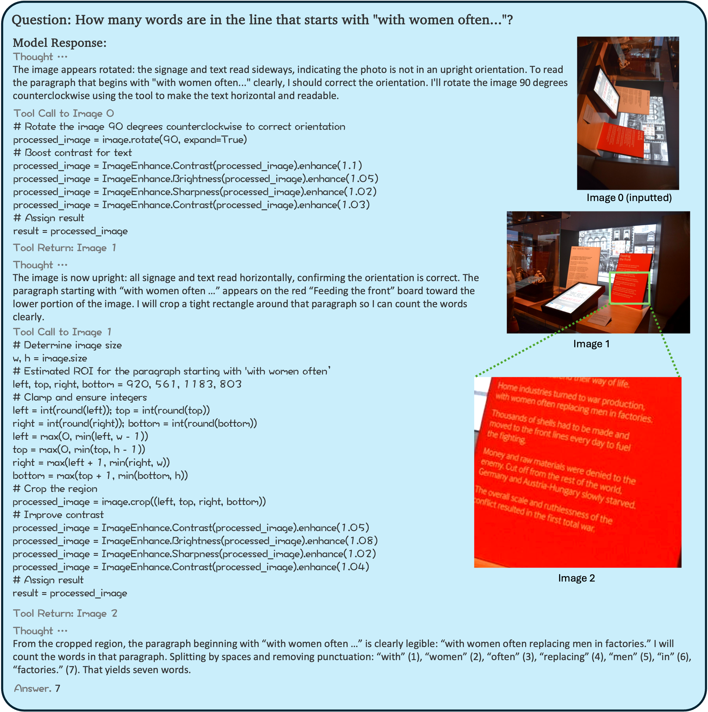
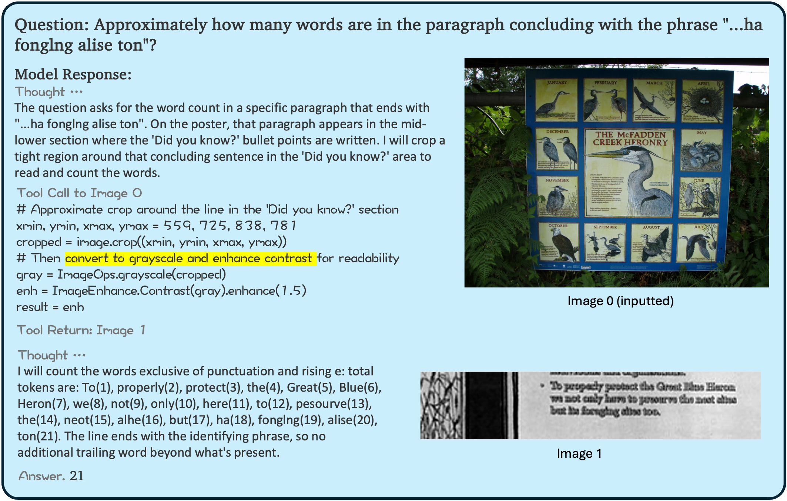
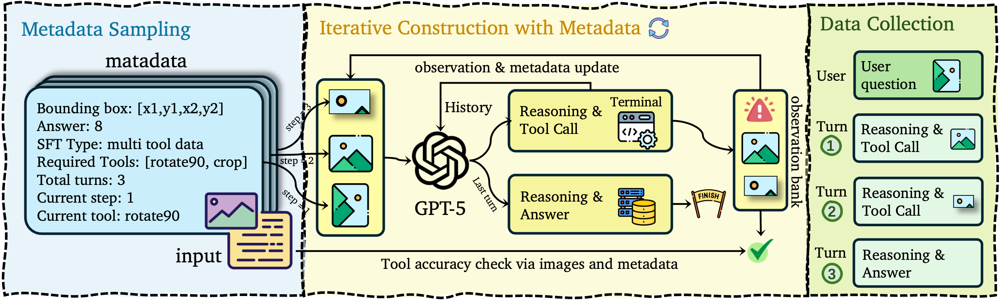

<div align="center">

</div>

<h1 align="center">Thinking with Programming Vision: Towards a Unified View for Thinking with Images</h1>


<div align="center">
<a href="https://www.apache.org/licenses/LICENSE-2.0"></a>
<a href="https://arxiv.org/abs/2512.03746" target="_blank"></a>
<a href="https://github.com/ByteDance-BandAI/CodeVision" target="_blank"></a>
<a href="https://huggingface.co/datasets/kkwok/CodeVision-SFT" target="_blank"></a>
</div>

## Overview

CodeVision is a framework leveraging code-as-tool and comprehensive SFT/RL datasets to enable "**thinking with images**". It provides a unified view for reasoning with visual information using programming vision.

### Key Features
- **Multi-turn Agent Loops**: Supports complex interactions and reasoning chains for **Qwen2.5-VL** and **Qwen3-VL series**.
- **Comprehensive Datasets**: Includes high-quality SFT datasets (constructed via GPT-5-High) and RL datasets covering diverse domains.
- **Thinking with Images**: Enables models to process and reason about visual content programmatically.

<div align="center">

</div>

## Case Studies

These examples demonstrate the agent's ability to perform multi-turn reasoning and emergent tool usage.

| Case 1 | Case 2 |
| :---: | :---: |
|  |  |

## Getting Started

### 1. Environment Setup

Install the required dependencies. You need to choose between `vllm` and `sglang` for the inference backend.

```bash
pip install "torch==2.8.0" "torchvision==0.23.0"

# vllm >= 0.11.0 or sglang >= 0.5.3 for Qwen3-VL series support
# Pick one stack: vLLM OR SGLang (install the one you need)
pip install vllm==0.11.0          # option 1: vLLM stack
pip install "sglang[all]==0.5.3"  # option 2: SGLang stack

# transformers >= 4.57.0 for Qwen3-VL series support
pip3 install transformers==4.57.0

# FlashAttention
pip install --no-cache-dir --use-pep517 flash-attn==2.8.3 --no-build-isolation

# Other dependencies
pip install -r requirements-runtime.txt
```

### 2. Training & Evaluation

#### Stage 1: Supervised Fine-Tuning (SFT)

The SFT process uses [LLaMA-Factory](https://github.com/hiyouga/LLaMA-Factory).

1.  **Prepare Data**: Download the [CodeVision-SFT Dataset](https://huggingface.co/datasets/kkwok/CodeVision-SFT).
2.  **Configure**:
    *   Update `LLaMA-Factory/data/dataset_info.json` with your data path.
    *   Review config files: `LLaMA-Factory/examples/train_full/qwen2_5vl_full_sft.yaml` or `LLaMA-Factory/examples/train_full/qwen3vl.yaml`.
3.  **Train**:

    ```bash
    cd LLaMA-Factory
    pip install -e ".[torch,metrics]" --no-build-isolation
    # Example for Qwen3-VL Full SFT
    FORCE_TORCHRUN=1 llamafactory-cli train examples/train_full/qwen3vl.yaml
    ```

<div align="center">

</div>

#### Stage 2: Reinforcement Learning (RL)

Once you have the SFT model, proceed to RL training.

1.  **Prepare Data**: Download the [CodeVision-RL Dataset](https://huggingface.co/datasets/kkwok/CodeVision-RL).
2.  **Deploy Judge**: Start the LLM judge server (required for reward/evaluation).

    ```bash
    vllm serve Qwen3-235B-A22B-Instruct-2507 \
        --port 18901 \
        --host :: \
        --gpu-memory-utilization 0.8 \
        --max-model-len 32768 \
        --tensor-parallel-size 8 \
        --trust-remote-code \
        --disable-log-requests
    ```

3.  **Train**: Update the configuration in `recipe/codevision/qwen3_vl.sh` (e.g., set `MODEL_PATH`, `LLM_JUDGE` and `train_files` ...) and run:

    ```bash
    bash recipe/codevision/qwen3_vl.sh
    ```

#### Evaluation

To evaluate your model on benchmarks:

1.  Edit `recipe/codevision/eval.sh` to include your target benchmarks (update `test_files` and `LLM_JUDGE`).
2.  Run the evaluation script:

    ```bash
    bash recipe/codevision/eval.sh
    ```

## Citation

If you find this work useful, please cite our paper:

```bibtex
@article{guo2025thinking,
  title={Thinking with Programming Vision: Towards a Unified View for Thinking with Images},
  author={Guo, Zirun and Hong, Minjie and Zhang, Feng and Jia, Kai and Jin, Tao},
  journal={arXiv preprint arXiv:2512.03746},
  year={2025}
}
```
