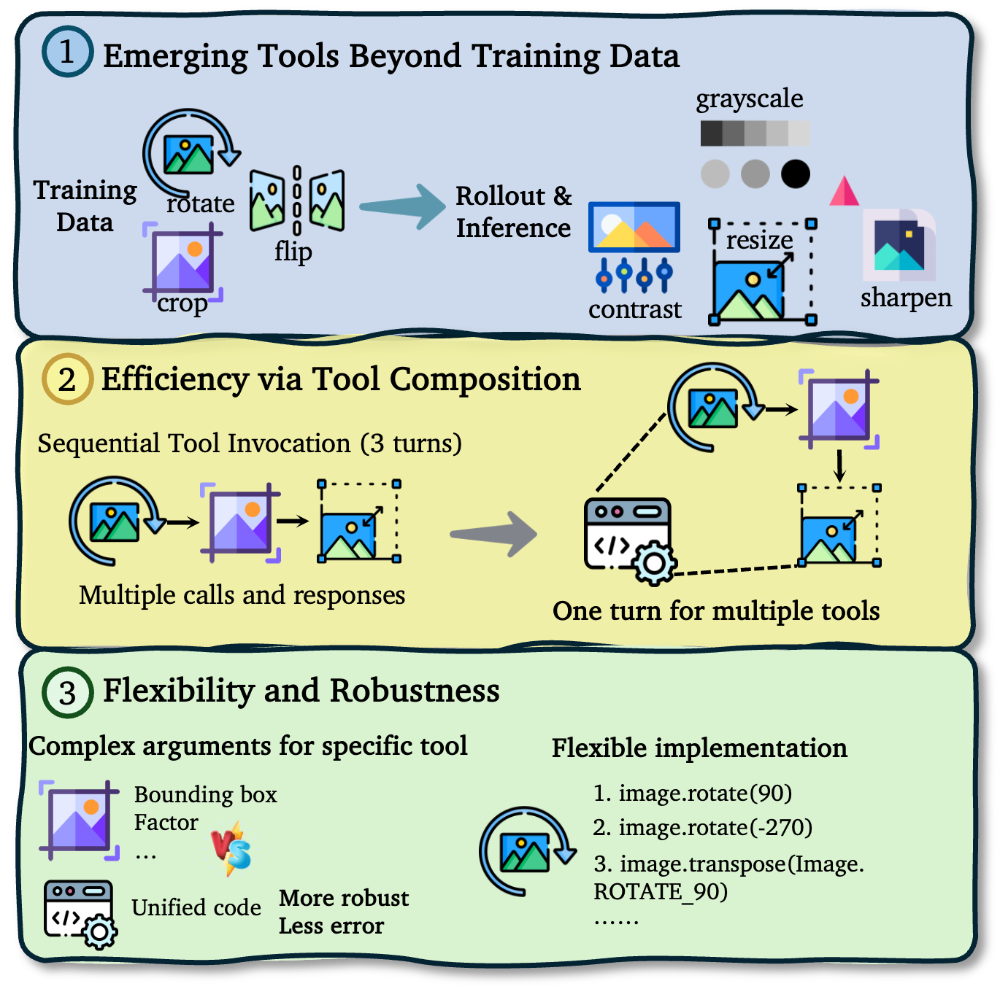

<h1 align="center">Thinking with Programming Vision: Towards a Unified View for Thinking with Images</h1>

## Overview

- **Introduction**: A framework leveraging code-as-tool and comprehensive SFT/RL datasets for "thinking with images".

- **Features**: Supports multi-turn agent loops for the Qwen2.5-VL and Qwen3-VL series.

- **Datasets**: Includes an SFT dataset constructed using GPT-5-High and an RL dataset covering diverse domains.

## Getting Started

Coming soon...
